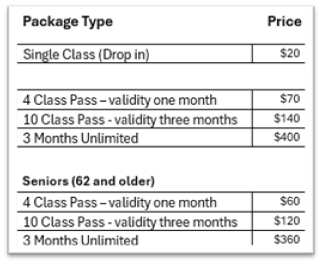

# Overview

## Background

**YogaNest** was founded in 2003 with a vision to promote yoga and its benefits by offering authentic, affordable and quality yoga education, practice space and support to the community.
The studio is in the suburbs of Pittsburgh, PA and offers yoga classes and workshops every day including weekends. Though most of the classes are designed and delivered to suit all levels of yoga practitioners, some of the classes offer specific types of yoga practice such as Chair Yoga for seniors or Gentle Yoga for beginners. The classes are led by various yoga instructors.
See Figure1

Fig. 1: Class Schedule

To attend regular weekly classes, the customers can buy class passes as a 4 or 10 classes package or a 3-month unlimited package. All the packages have a valid period.
The customer can also buy a one class drop-in pass. The studio also offers a discounted price for all its packages to seniors. See Figure 2
The studio also offers various workshops e.g. Yoga and Breathwork, and special program series like Prenatal Yoga The workshops and Special Programs are offered at different prices.

Fig. 2: Class Packages

## The Problem

The studio is currently using a manual process of keeping its sales and class-attendance records. A paper card is created for every customer to keep a record of classes bought and attended. The card is updated whenever a customer buys a new package or attends a class.

Alongside, a class attendance sheet is signed for each class where all attendees sign their name, the type of package they are using for the class, and the mode of payment if they have paid to attend the class. The sheet also as class details such as date, time, and the name of the instructor.

Fig. 3: Attendance Sheet

The studio is under new management and an aggressive marketing strategy is being rolled out to grow the business. To avoid manual work and human errors, the studio needs an automated system of recording its sales of packages and recording the attendance of each class. This will help the management to keep the record of the classes bought by each customer based on validity dates.
